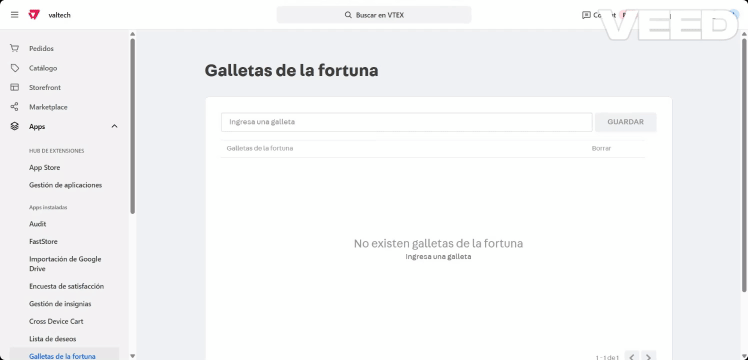

# Fortune Cookies Admin

Aplicación de administración para gestionar frases de "galletas de la fortuna" en Master Data de VTEX.

---

---

## 📦 Instrucciones de instalación y despliegue

### Requisitos previos

- Node.js >= 12.x
- VTEX Toolbelt (`yarn i -g vtex`)
- Acceso a una cuenta VTEX IO con permisos de desarrollador

### Instalación local

1. **Clona el repositorio:**
   ```sh
   git clone <url-del-repositorio>
   cd fortune-cookies-admin
   ```

2. **Instala dependencias del frontend:**
   ```sh
   cd react
   yarn
   ```

3. **Vincula la app a tu cuenta VTEX:**
   ```sh
   vtex login <tu-cuenta>
   vtex use <tu-workspace>
   vtex link
   ```

4. **Accede a la app:**
   - Ve a `https://<workspace>--<account>.myvtex.com/admin/app/fortune-cookies`

### Despliegue en producción

1. **Publica la app:**
   ```sh
   vtex publish
   ```

2. **Instala la app en el workspace master:**
   ```sh
   vtex install <vendor>.fortune-cookies-admin@<version>
   ```

---

## 🏗️ Descripción general de la arquitectura

- **Frontend:**  
  - React + TypeScript
  - Uso de VTEX Styleguide para UI
  - Internacionalización con `react-intl`
  - Hooks personalizados para lógica de negocio (`useFortuneCookies`)
  - Comunicación con Master Data vía fetch y endpoints REST

- **Estructura principal:**
  ```
  react/
    components/
      adminPanel/         # Componente principal de administración
    hooks/
      useFortuneCookies.ts # Hook para lógica de negocio y estado
    services/
      fortuneCookiesService.ts # Funciones para interactuar con Master Data
    types/
      fortuneCookies.ts   # Tipos TypeScript
  admin/
    routes.json          # Rutas de la app admin
    navigation.json      # Configuración de menú en admin
  messages/
    *.json               # Archivos de internacionalización
  ```

- **Master Data:**  
  - Entidad: `CF`  
  - Campos: `id`, `CookieFortune`

---

## 🔌 Endpoints e integraciones

### Endpoints usados (Master Data)

- **Obtener frases (paginado):**
  ```
  GET /api/dataentities/CF/search?_fields=id,CookieFortune&_sort=createdIn DESC
  Headers:
    REST-Range: resources={from}-{to}
  ```

- **Crear nueva frase:**
  ```
  POST /api/dataentities/CF/documents
  Body: { "CookieFortune": "<texto>" }
  ```

- **Eliminar frase:**
  ```
  DELETE /api/dataentities/CF/documents/{id}
  ```

- **Verificar existencia de documento:**
  ```
  GET /api/dataentities/CF/documents/{id}
  ```

### Integraciones

- **VTEX Styleguide:**  
  Para componentes visuales y tablas.
- **react-intl:**  
  Para internacionalización de la interfaz.
- **Master Data:**  
  Todas las operaciones CRUD se realizan sobre la entidad `CF` de Master Data vía REST API.

---

## 🚦 Notas adicionales

- El paginador y la tabla se actualizan automáticamente al agregar o eliminar frases.
- El botón "Borrar todas las galletas de la fortuna" elimina todos los registros de la entidad, no solo los visibles en la página actual.
- El código está preparado para internacionalización (es, en, pt).

---

¿Dudas o sugerencias?  
Abre un issue o contacta al equipo de desarrollo.
Implementado por: Lennin Ibarra Desarrollador Frontend - ing.lenninibarra@gmail.com
